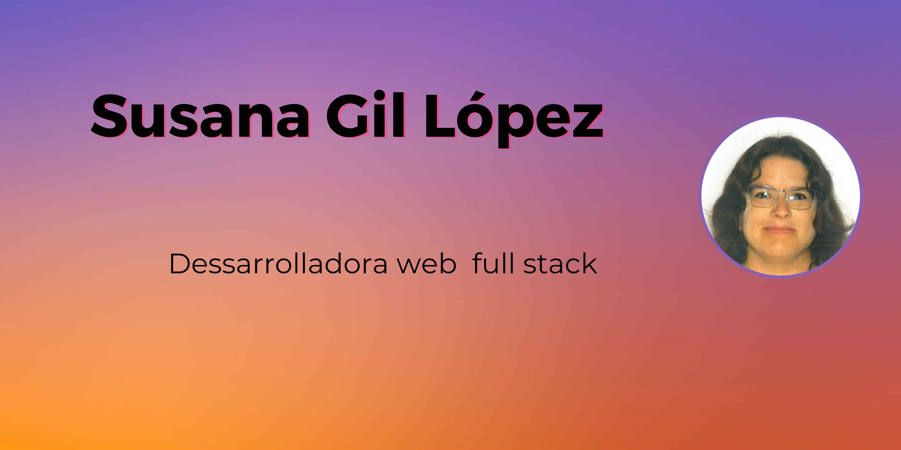

# Buenas!!!👋 Me llamo Susana. 

Soy estudiante de la Bootcamp Full-Stack developer en Factoria F5 (850h) donde estamos aprendiendo mediante metodologias ágiles y pedagogia activa, diferentes lenguajes de programación.

## Tecnologías

* HTML: Version HTML 5 
* CSS: Version CSS3
* [Javascript] (https://www.javascript.com/)
* [Node.js] (https://nodejs.org/es/)
* [React] (https://es.reactjs.org/)
* [Bootstrap] (https://getbootstrap.com/)
* [Xampp] (https://xampp.uptodown.com/windows)
* [phpMySQL] (https://www.phpmyadmin.net/)
* [php] (https://www.php.net/)
* [Figma] (https://www.figma.com/)

## Contacto

 www.linkedin.com/in/susanagildeveloper
